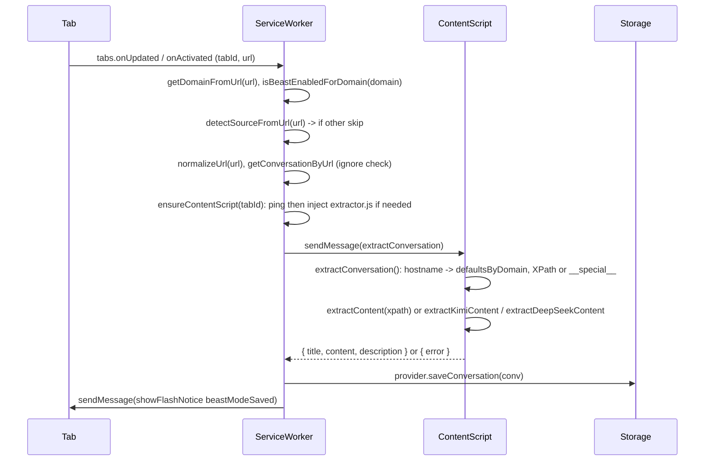
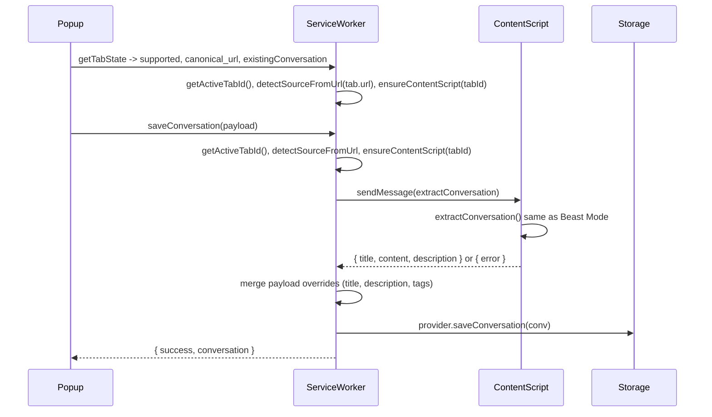
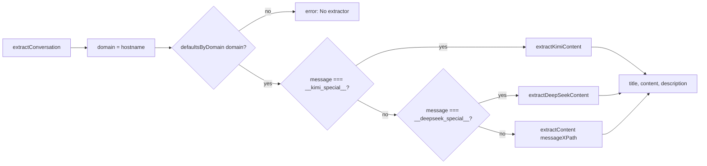

# Save Logic and Per-Website Extraction Principles

This document explains how the extension saves conversations and retrieves data per website, why ChatGPT works reliably and other sites often break, and how to fix each website systematically.

---

## 1. Where the logic lives

| Layer | File | Responsibility |
|-------|------|----------------|
| **Trigger** | `src/background/service-worker.ts` | Beast Mode (tab update/activate), manual save from popup |
| **Source / URL** | `src/background/url-detector.ts` | Map hostname to source; normalize URL; get domain |
| **Extraction** | `src/content-scripts/extractor.ts` | Domain to XPath or special handler; `extractConversation()` returns `{ title, content, description }` |
| **Save** | `src/background/service-worker.ts` | `handleSaveConversation` / Beast Mode: get extraction, build `Conversation`, call `provider.saveConversation()` |

Content script is declared in `manifest.json` (`content_scripts.matches` and `js`) and can be injected programmatically in `ensureContentScript()` via `chrome.scripting.executeScript` with `files: ['src/content-scripts/extractor.js']`.

---

## 2. Why ChatGPT works and others often don’t

**ChatGPT** uses a **semantic, stable selector**:

- In `extractor.ts`: `message: '//div[@data-message-author-role]'`.
- This targets **each message by role**, not by layout. Layout changes (new wrappers, sidebars) do not break it.
- Title comes from `document.title`.
- No long absolute path; no dependency on `#root` or exact DOM depth.

**Other sites** typically use:

- **Absolute XPaths** (Mistral, Grok, Perplexity): e.g. `/html/body/main/div/div[1]/...` or a long path under `#root`. Any DOM change (new div, A/B layout) breaks the path.
- **Single ID + path** (Qwen `#chat-message-container`, Manus, Perplexity under `#root`): IDs can change or be duplicated in SPAs; the path after the ID is still brittle.
- **Special handlers** (Kimi, DeepSeek): Multiple hardcoded XPaths and fallbacks; still depend on current DOM (e.g. `#page-layout-container`, `#root`).

So the main difference is **selector stability**: ChatGPT uses a **semantic attribute**; others use **structure-based** selectors that break when the site updates.

Secondary issues:

- **Hostname alignment**: Extraction uses `window.location.hostname` to look up config. If the user lands on `perplexity.ai` (no www), `url-detector` returns `'other'` (only `www.perplexity.ai` is mapped), so Beast Mode skips; the manifest also only lists `www.perplexity.ai` in `content_scripts.matches`.
- **Content script injection**: If the script is not loaded (wrong URL, build path, or SPA navigation), `sendMessage('extractConversation')` fails and save/Beast Mode stops.

---

## 3. Sequence workflows

### 3.1 Beast Mode (auto-save)

### 3.2 Manual save (popup)

### 3.3 Extraction per website (content script)

---

## 4. Per-website table (existing patterns)

The table below reflects the current config in `extractor.ts`, `url-detector.ts`, and `manifest.json`. For a machine-readable list you can edit per website, see **`chrome_extension/config/extractor-defaults.json`**. The file has a top-level `hosts` object keyed by hostname; each entry has `source`, `title`, `conversation`, `message`, `selectorType`, `inManifest`, `inUrlDetector`, and optional `notes`.

| Host | Source | Title | Message pattern | Selector type | In manifest | In url-detector | Notes |
|------|--------|-------|------------------|---------------|-------------|-----------------|-------|
| `chat.openai.com` | chatgpt | documentTitle | `//div[@data-message-author-role]` | semantic | yes | yes | Stable; works well. |
| `chatgpt.com` | chatgpt | documentTitle | `//div[@data-message-author-role]` | semantic | yes | yes | Same as above. |
| `www.chatgpt.com` | chatgpt | documentTitle | `//div[@data-message-author-role]` | semantic | yes | yes | Same as above. |
| `claude.ai` | claude | — | — | — | yes | yes | **Missing in extractor**; add config to work. |
| `www.perplexity.ai` | perplexity | documentTitle | long path under `#root` | absolutePath | yes | yes | Brittle; breaks on layout change. |
| `perplexity.ai` | other | documentTitle | long path under `#root` | absolutePath | no | no | In extractor only; add to manifest + url-detector to enable. |
| `kimi.moonshot.cn` | kimi | — | — | — | yes | yes | **Missing in extractor**; would need special or XPath. |
| `www.kimi.com` | kimi | documentTitle | `__kimi_special__` | special | yes | yes | Multi-strategy fallback. |
| `kimi.com` | kimi | documentTitle | `__kimi_special__` | special | yes | yes | Same as above. |
| `chat.mistral.ai` | mistral | documentTitle | long absolute path from `/html/body/main/...` | absolutePath | yes | yes | Brittle. |
| `chat.deepseek.com` | deepseek | documentTitle | `__deepseek_special__` | special | yes | yes | Multi-strategy fallback. |
| `chat.qwen.ai` | qwen | documentTitle | `//*[@id="chat-message-container"]` | id | yes | yes | ID-based; can break if ID changes. |
| `manus.im` | manus | documentTitle | `//*[@id="manus-home-page-session-content"]` | id | yes | yes | ID-based. |
| `grok.com` | grok | documentTitle | `/html/body/div[2]/div[2]/...` | absolutePath | yes | yes | Brittle. |

**Selector types:**

- **semantic**: Attribute-based (e.g. `data-message-author-role`); most stable.
- **id**: Single element ID; stable only if the app never changes it.
- **absolutePath**: Full path from document root; breaks on any DOM change.
- **special**: Custom function in extractor (Kimi, DeepSeek) with multiple fallbacks.

---

## 5. Per-website fix checklist

Use this for **each** site where save or Beast Mode fails.

### Step 1: Confirm the site is in the pipeline

| Check | Where | What to do |
|-------|--------|------------|
| **Host in manifest** | `manifest.json` → `content_scripts[0].matches` and `host_permissions` | Add `https://<host>/*` for the host the user actually uses (e.g. `perplexity.ai`). |
| **Source detected** | `url-detector.ts` → `detectSourceFromUrl()` | Add a branch for that hostname (e.g. `perplexity.ai`). |
| **Extractor config** | `extractor.ts` → `defaultsByDomain` or `config/extractor-defaults.json` | Add an entry keyed by `window.location.hostname`. |

If any of these is missing, Beast Mode can skip (`source === 'other'`) or extraction can return “No extractor configured for domain”.

### Step 2: Prefer a stable selector (why ChatGPT wins)

| Prefer | Avoid |
|--------|--------|
| Semantic attributes: `//*[@data-message-author-role]`, `//*[@role="article"]`, `[data-testid="message"]` | Long absolute XPaths from `<html>`. |
| Stable IDs only if the app never renames them: `//*[@id="chat-message-container"]` | Deep paths under `#root` with many indices. |
| One selector that returns **each message node** (then iterate and get text). | One selector that returns the whole thread (noisier). |

On a real conversation page in DevTools:

1. Find the **smallest container** that wraps one message (user or assistant).
2. Note **attributes**: `data-*`, `role`, `data-testid`, stable `id`/`class`.
3. Prefer an XPath that uses those and does **not** depend on exact div positions.

### Step 3: Response type and “form path”

- **Response type**: Extraction returns `{ title, content, description }` or `{ error }`. The service worker expects `extracted.content` (string). If the DOM is empty (SPA not rendered yet), `content` is `''` and save “works” but with an empty body. Consider timing (Beast Mode debounce 2s; manual save when user clicks).
- **Form path / URL**: The extractor uses **hostname** only, not route. Same hostname = same config. If a site uses different routes with different DOMs, you may need route-specific logic later.

### Step 4: Verify in context

1. **Content script present**: On the target page, DevTools → Console; run or check that `extractConversation` runs (e.g. temporary `console.log(domain, messageXPath)` in `extractor.ts`).
2. **XPath on live DOM**: In Console, run `document.evaluate('<your_xpath>', document, null, XPathResult.ORDERED_NODE_SNAPSHOT_TYPE, null)` and check `snapshotLength` and that nodes are message nodes.
3. **End-to-end**: Open popup on that tab → Save; confirm saved conversation has non-empty content and correct title.

### Step 5: Special handlers (Kimi, DeepSeek)

For sites using `__kimi_special__` or `__deepseek_special__`, update the **first** XPath inside `extractKimiContent()` / `extractDeepSeekContent()` to a more stable selector if the site changed. Keep the fallback chain but make the first strategy use an attribute or ID that is unlikely to change.

---

## 6. Machine-readable config: `config/extractor-defaults.json`

All per-website patterns are also stored in **`config/extractor-defaults.json`**. You can:

- Edit that JSON to add or change hosts, message XPaths, selector types, and notes.
- Use it as the single source of truth and, if desired, generate or sync `extractor.ts` `defaultsByDomain` from it (e.g. via a small script or build step).

See **`chrome_extension/config/extractor-defaults.json`** for the current entries. Each host entry has: `source`, `title`, `conversation`, `message`, `selectorType`, `inManifest`, `inUrlDetector`, `notes`. The extractor loads this file at **build time** (it is bundled into the content script). Edit the JSON, then run `pnpm run build` (or your build command) to recompile; no code change in `extractor.ts` is required.
