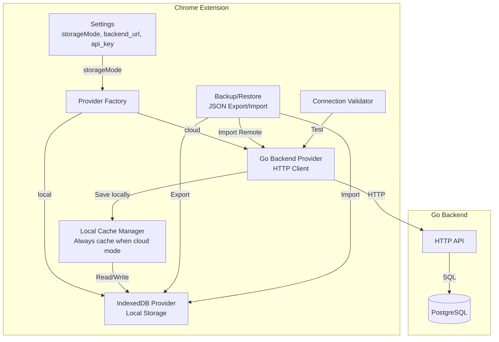

# Extension API Integration: Provider, Backup/Restore, Connection Validation

## Overview

This plan covers the **Chrome extension side** - implementing the Go backend provider, backup/restore functionality, connection validation, and local caching when using PostgreSQL. This integrates with the remote Go backend infrastructure.

## Architecture



## Key Requirements

1. **Local Caching**: When `storageMode === 'cloud'`, always save to IndexedDB locally **unless** `disable_local_cache` option is checked
2. **Connection Validation**: Test backend connection before enabling cloud mode
3. **Provider Switching**: Seamless switching between IndexedDB and Go backend based on settings
4. **Backup/Restore**: Export/import all data to/from JSON

## Phase 1: Backup/Restore Implementation

### 1.1 Backup Format

**File**: `src/types/backup.ts` (new)

```typescript
export interface BackupData {
  version: string;              // "1.0"
  exported_at: string;          // ISO 8601 timestamp
  conversations: Conversation[];
  snippets: Snippet[];
  collections: Collection[];
  settings: Settings;
}
```

### 1.2 Backup Export

**File**: `src/lib/storage/indexeddb-backup.ts` (new)

Add to `IndexedDBProvider`:
- `exportBackup(): Promise<BackupData>` - Export all data to JSON structure
- `downloadBackup(): Promise<void>` - Trigger browser download of JSON file

**Implementation**:
- Read all object stores (conversations, snippets, collections, settings)
- Convert Date objects to ISO 8601 strings
- Create BackupData object
- Generate downloadable JSON file

### 1.3 Backup Import (Local)

**File**: `src/lib/storage/indexeddb-backup.ts`

Add to `IndexedDBProvider`:
- `importBackup(backup: BackupData, options?: ImportOptions): Promise<ImportResult>` - Import from JSON

**Options**:
```typescript
interface ImportOptions {
  overwrite?: boolean;          // Overwrite existing items (default: true)
  skipSettings?: boolean;        // Don't import settings (default: false)
}
```

**Conflict Resolution**:
- If `canonical_url` exists → update (increment version)
- If new → create
- Return statistics (created, updated, errors)

### 1.4 Backup UI

**File**: `src/popup/popup.html`

Add to Settings tab:
```html
<div class="settings-section">
  <h3>Backup & Restore</h3>
  <button id="export-backup">Export Backup</button>
  <button id="import-backup">Import Backup</button>
  <input type="file" id="backup-file-input" accept=".json" style="display:none;">
</div>
```

**File**: `src/popup/popup.ts`

- Handle export button → call `downloadBackup()`
- Handle import button → file picker → read file → call `importBackup()`
- Show confirmation dialog before import
- Show success/error flash notices

## Phase 2: Settings Updates

### 2.1 Update Settings Interface

**File**: `src/types/settings.ts`

```typescript
export interface Settings {
  id?: number;
  storageMode: 'local' | 'cloud';
  backend_url?: string;              // Go backend URL (replaces postgrest_url)
  api_key?: string;                   // API key for authentication (replaces postgrest_auth)
  disable_local_cache?: boolean;      // If true, don't cache locally when using cloud mode
  beast_enabled_per_domain: Record<string, boolean>;
  selective_mode_enabled: boolean;
  devModeEnabled: boolean;
  xpaths_by_domain: Record<string, {
    conversation: string;
    message: string;
  }>;
}
```

### 2.2 Update Popup UI

**File**: `src/popup/popup.html`

Replace PostgREST fields with:
```html
<div class="settings-section">
  <h3>Remote Backend (Go API)</h3>
  <label>
    Backend URL
    <input id="backend-url" type="text" placeholder="http://localhost:8080">
  </label>
  <label>
    API Key
    <input id="api-key" type="password" placeholder="Bearer ...">
  </label>
  <button id="test-connection">Test Connection</button>
  <div id="connection-status"></div>
  <label>
    <input type="checkbox" id="disable-local-cache">
    Disable local caching (cloud mode only)
  </label>
</div>
```

**File**: `src/popup/popup.ts`

- Update settings loading/saving to use `backend_url` and `api_key`
- Add connection test button handler
- Show connection status (success/error)
- Handle `disable_local_cache` checkbox

## Phase 3: Go Backend Provider

### 3.1 Provider Implementation

**File**: `src/lib/storage/go-backend-provider.ts` (new)

```typescript
export class GoBackendProvider implements StorageProvider {
  private baseUrl: string;
  private apiKey?: string;
  private localCache?: IndexedDBProvider;  // For local caching

  constructor(baseUrl: string, apiKey?: string, enableLocalCache: boolean = true) {
    this.baseUrl = baseUrl.replace(/\/+$/, ''); // Remove trailing slashes
    this.apiKey = apiKey;
    
    // Always create local cache if enabled
    if (enableLocalCache) {
      this.localCache = new IndexedDBProvider();
    }
  }

  // Implement all StorageProvider methods
  // For each write operation: save to backend AND local cache (if enabled)
  // For each read operation: try local cache first, then backend
}
```

### 3.2 HTTP Client

**File**: `src/lib/storage/go-backend-provider.ts`

Helper method:
```typescript
private async request<T>(
  method: string,
  endpoint: string,
  body?: any
): Promise<T> {
  const headers: HeadersInit = {
    'Content-Type': 'application/json',
  };
  
  if (this.apiKey) {
    headers['Authorization'] = `Bearer ${this.apiKey}`;
  }
  
  const response = await fetch(`${this.baseUrl}${endpoint}`, {
    method,
    headers,
    body: body ? JSON.stringify(body) : undefined,
  });
  
  if (!response.ok) {
    throw new Error(`Backend error: ${response.status} ${response.statusText}`);
  }
  
  return response.json();
}
```

### 3.3 Read Operations (with Local Cache)

**Example**: `getConversationByUrl`
```typescript
async getConversationByUrl(canonicalUrl: string): Promise<Conversation | null> {
  // Try local cache first (if enabled)
  if (this.localCache) {
    const cached = await this.localCache.getConversationByUrl(canonicalUrl);
    if (cached) {
      return cached; // Return cached version
    }
  }
  
  // Fetch from backend
  const encoded = encodeURIComponent(canonicalUrl);
  const conv = await this.request<Conversation>(
    'GET',
    `/api/conversations/url/${encoded}`
  );
  
  // Save to local cache (if enabled)
  if (conv && this.localCache) {
    await this.localCache.saveConversation(conv);
  }
  
  return conv;
}
```

### 3.4 Write Operations (Dual Write)

**Example**: `saveConversation`
```typescript
async saveConversation(conversation: Conversation): Promise<Conversation> {
  // Save to backend
  const saved = await this.request<Conversation>(
    'POST',
    '/api/conversations',
    conversation
  );
  
  // Also save to local cache (if enabled)
  if (this.localCache) {
    await this.localCache.saveConversation(saved);
  }
  
  return saved;
}
```

### 3.5 Error Handling

- Network errors → Show user-friendly message
- 401 Unauthorized → Prompt to check API key
- 404 Not Found → Return null (valid for get operations)
- Other errors → Log and throw with context

### 3.6 Date Serialization

- Convert `Date` objects to ISO 8601 strings before sending
- Convert ISO 8601 strings back to `Date` objects when receiving

## Phase 4: Connection Validation

### 4.1 Connection Test

**File**: `src/lib/storage/go-backend-provider.ts`

Add static method:
```typescript
static async testConnection(
  baseUrl: string,
  apiKey?: string
): Promise<{ success: boolean; message: string }> {
  try {
    const headers: HeadersInit = {};
    if (apiKey) {
      headers['Authorization'] = `Bearer ${apiKey}`;
    }
    
    const response = await fetch(`${baseUrl}/api/health`, {
      method: 'GET',
      headers,
    });
    
    if (response.ok) {
      return { success: true, message: 'Connection successful' };
    } else {
      return { 
        success: false, 
        message: `Connection failed: ${response.status} ${response.statusText}` 
      };
    }
  } catch (error) {
    return {
      success: false,
      message: `Connection error: ${error.message}`,
    };
  }
}
```

### 4.2 UI Integration

**File**: `src/popup/popup.ts`

```typescript
async function testBackendConnection() {
  const url = (document.getElementById('backend-url') as HTMLInputElement)?.value;
  const apiKey = (document.getElementById('api-key') as HTMLInputElement)?.value;
  const statusDiv = document.getElementById('connection-status');
  
  if (!url) {
    showFlashNotice('Please enter a backend URL', 'error');
    return;
  }
  
  statusDiv.textContent = 'Testing connection...';
  
  const result = await GoBackendProvider.testConnection(url, apiKey);
  
  if (result.success) {
    statusDiv.textContent = '✓ Connection successful';
    statusDiv.style.color = 'green';
    showFlashNotice('Connection successful', 'success');
  } else {
    statusDiv.textContent = `✗ ${result.message}`;
    statusDiv.style.color = 'red';
    showFlashNotice(result.message, 'error');
  }
}
```

## Phase 5: Provider Factory

### 5.1 Factory Function

**File**: `src/lib/storage/storage-provider.ts`

```typescript
import { IndexedDBProvider } from './indexeddb-provider';
import { GoBackendProvider } from './go-backend-provider';
import type { Settings } from '../../types/settings';

export function createStorageProvider(settings: Settings): StorageProvider {
  if (settings.storageMode === 'cloud' && settings.backend_url) {
    const enableLocalCache = !settings.disable_local_cache;
    return new GoBackendProvider(
      settings.backend_url,
      settings.api_key,
      enableLocalCache
    );
  }
  return new IndexedDBProvider();
}
```

### 5.2 Update Service Worker

**File**: `src/background/service-worker.ts`

Replace direct `IndexedDBProvider` instantiation:
```typescript
// Old:
const provider = new IndexedDBProvider();

// New:
let provider: StorageProvider;

async function getProvider(): Promise<StorageProvider> {
  if (!provider) {
    const settings = await chrome.storage.local.get(['storageMode', 'backend_url', 'api_key', 'disable_local_cache']);
    // Convert chrome.storage format to Settings interface
    const settingsObj: Settings = {
      storageMode: settings.storageMode || 'local',
      backend_url: settings.backend_url,
      api_key: settings.api_key,
      disable_local_cache: settings.disable_local_cache,
      beast_enabled_per_domain: {},
      selective_mode_enabled: false,
      devModeEnabled: false,
      xpaths_by_domain: {},
    };
    provider = createStorageProvider(settingsObj);
  }
  return provider;
}

// Use getProvider() instead of direct provider access
```

## Phase 6: Backup Import to Remote DB

### 6.1 Remote Import Method

**File**: `src/lib/storage/go-backend-provider.ts`

```typescript
async importBackup(backup: BackupData): Promise<ImportResult> {
  const result = await this.request<ImportResult>(
    'POST',
    '/api/backup/import',
    backup
  );
  
  // If local cache is enabled, also import to local cache
  if (this.localCache) {
    await this.localCache.importBackup(backup, { skipSettings: true });
  }
  
  return result;
}
```

### 6.2 UI Integration

**File**: `src/popup/popup.ts`

Add "Import to Remote DB" button:
```typescript
async function importBackupToRemote() {
  const fileInput = document.getElementById('backup-file-input') as HTMLInputElement;
  const file = fileInput.files?.[0];
  
  if (!file) {
    showFlashNotice('Please select a backup file', 'error');
    return;
  }
  
  const settings = await loadSettings();
  if (settings.storageMode !== 'cloud' || !settings.backend_url) {
    showFlashNotice('Please configure and enable cloud mode first', 'error');
    return;
  }
  
  const text = await file.text();
  const backup: BackupData = JSON.parse(text);
  
  const provider = new GoBackendProvider(
    settings.backend_url,
    settings.api_key,
    !settings.disable_local_cache
  );
  
  try {
    const result = await provider.importBackup(backup);
    showFlashNotice(
      `Import successful: ${result.created} created, ${result.updated} updated`,
      'success'
    );
  } catch (error) {
    showFlashNotice(`Import failed: ${error.message}`, 'error');
  }
}
```

## Phase 7: Migration from PostgREST Settings

### 7.1 Settings Migration

**File**: `src/lib/storage/indexeddb-utils.ts`

Add migration function:
```typescript
export async function migrateSettingsFromPostgREST(): Promise<void> {
  const db = await openDatabase();
  const tx = db.transaction('settings', 'readwrite');
  const store = tx.objectStore('settings');
  
  return new Promise((resolve, reject) => {
    const request = store.get(1);
    request.onsuccess = () => {
      const settings = request.result;
      if (settings && settings.postgrest_url && !settings.backend_url) {
        // Migrate postgrest_url to backend_url
        settings.backend_url = settings.postgrest_url;
        settings.api_key = settings.postgrest_auth;
        delete settings.postgrest_url;
        delete settings.postgrest_auth;
        
        const updateRequest = store.put(settings);
        updateRequest.onsuccess = () => resolve();
        updateRequest.onerror = () => reject(updateRequest.error);
      } else {
        resolve();
      }
    };
    request.onerror = () => reject(request.error);
  });
}
```

Call this on IndexedDB initialization.

## Implementation Todos

- [ ] Create BackupData interface and backup format
- [ ] Implement exportBackup() in IndexedDBProvider
- [ ] Implement downloadBackup() with file download
- [ ] Implement importBackup() in IndexedDBProvider with conflict resolution
- [ ] Add Export/Import buttons to popup UI
- [ ] Update Settings interface (backend_url, api_key, disable_local_cache)
- [ ] Update popup HTML to show Go backend fields instead of PostgREST
- [ ] Implement GoBackendProvider class with all StorageProvider methods
- [ ] Implement local caching logic (dual write, cache-first read)
- [ ] Implement connection test method
- [ ] Add connection test button and status display in popup
- [ ] Create provider factory function
- [ ] Update service worker to use provider factory
- [ ] Implement remote backup import in GoBackendProvider
- [ ] Add "Import to Remote DB" button in popup
- [ ] Implement settings migration from PostgREST to Go backend
- [ ] Add error handling and user-friendly messages
- [ ] Test local caching behavior (enabled/disabled)
- [ ] Test provider switching (local ↔ cloud)
- [ ] Test backup export/import (local and remote)

## Key Implementation Notes

1. **Local Caching**: When `storageMode === 'cloud'` and `disable_local_cache !== true`, all operations should:
   - Write to both backend AND IndexedDB
   - Read from IndexedDB first (cache), then backend if not found
   - This ensures offline capability and faster reads

2. **Connection Validation**: Always validate connection before enabling cloud mode. Show clear error messages if connection fails.

3. **Error Handling**: Network errors should be handled gracefully. Consider retry logic for transient failures.

4. **Date Handling**: Convert between JavaScript `Date` objects and ISO 8601 strings consistently.

5. **Backward Compatibility**: Migrate existing PostgREST settings to new Go backend settings format.

