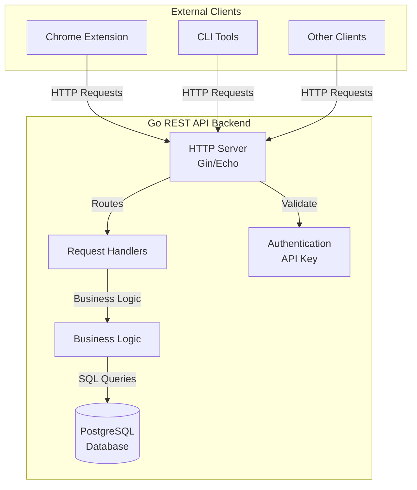

# Remote Infrastructure: Go Backend + PostgreSQL

## Overview

This plan covers the **remote infrastructure** - a standalone Go REST API server with PostgreSQL database. This is a separate project from the Chrome extension, deployable independently.

## Architecture



## Project Structure

```
backend/
├── cmd/
│   └── server/
│       └── main.go          # Entry point, server initialization
├── internal/
│   ├── api/
│   │   ├── handlers/         # HTTP handlers
│   │   │   ├── conversations.go
│   │   │   ├── snippets.go
│   │   │   ├── collections.go
│   │   │   ├── settings.go
│   │   │   ├── backup.go     # Backup import endpoint
│   │   │   └── health.go     # Health check
│   │   ├── middleware/       # HTTP middleware
│   │   │   ├── auth.go       # API key authentication
│   │   │   ├── cors.go       # CORS handling
│   │   │   └── error.go      # Error handling
│   │   └── routes.go         # Route definitions
│   ├── service/              # Business logic layer
│   │   ├── conversation.go
│   │   ├── snippet.go
│   │   ├── collection.go
│   │   ├── settings.go
│   │   └── backup.go         # Backup import logic
│   ├── repository/           # Database access layer
│   │   ├── conversation.go
│   │   ├── snippet.go
│   │   ├── collection.go
│   │   ├── settings.go
│   │   └── migrations.go      # Migration runner
│   └── models/               # Data models (structs)
│       ├── conversation.go
│       ├── snippet.go
│       ├── collection.go
│       ├── settings.go
│       └── backup.go         # Backup import models
├── pkg/
│   ├── database/             # DB connection pool
│   │   └── postgres.go
│   └── auth/                 # Authentication utilities
│       └── apikey.go
├── migrations/               # SQL migration files
│   ├── 001_initial.sql
│   └── README.md
├── config/
│   └── config.go            # Configuration management
├── .env.example             # Environment variables template
├── docker-compose.yml       # Local development setup
├── Dockerfile              # Production Docker image
├── go.mod
├── go.sum
└── README.md
```

## Phase 1: Project Setup

### 1.1 Initialize Go Project

**Files**: `go.mod`, `go.sum`

- Initialize Go module: `go mod init github.com/yourorg/ai-saver-backend`
- Dependencies:
  - `github.com/gin-gonic/gin` or `github.com/labstack/echo` (HTTP framework)
  - `github.com/jackc/pgx/v5` or `github.com/jmoiron/sqlx` (PostgreSQL driver)
  - `github.com/golang-migrate/migrate` (database migrations)
  - `github.com/joho/godotenv` (environment variables)
  - `github.com/google/uuid` (UUID generation if needed)

### 1.2 Configuration Management

**File**: `config/config.go`

Environment variables:
- `PORT` (default: 8080)
- `DB_HOST` (default: localhost)
- `DB_PORT` (default: 5432)
- `DB_USER`
- `DB_PASSWORD`
- `DB_NAME`
- `DB_SSL_MODE` (default: disable for dev, require for prod)
- `API_KEY_SECRET` (for validating API keys)
- `CORS_ORIGINS` (comma-separated allowed origins)

### 1.3 Docker Setup

**File**: `docker-compose.yml`

Local development environment:
- PostgreSQL 15 container
- Go backend container (hot reload for development)
- Volume mounts for code and migrations

## Phase 2: Database Schema

### 2.1 Migration File

**File**: `migrations/001_initial.sql`

PostgreSQL schema matching IndexedDB structure:

**Table: conversations**
```sql
CREATE TABLE conversations (
    id SERIAL PRIMARY KEY,
    canonical_url TEXT NOT NULL,
    share_url TEXT,
    source VARCHAR(50) NOT NULL,
    title TEXT NOT NULL,
    description TEXT,
    content TEXT NOT NULL,
    tags TEXT[] DEFAULT '{}',
    collection_id INTEGER,
    ignore BOOLEAN DEFAULT FALSE,
    version INTEGER DEFAULT 1,
    created_at TIMESTAMPTZ DEFAULT NOW(),
    updated_at TIMESTAMPTZ DEFAULT NOW(),
    UNIQUE(canonical_url)
);

CREATE INDEX idx_conversations_updated_at ON conversations(updated_at DESC);
CREATE INDEX idx_conversations_tags ON conversations USING GIN(tags);
CREATE INDEX idx_conversations_source ON conversations(source);
CREATE INDEX idx_conversations_collection_id ON conversations(collection_id);
```

**Table: snippets**
```sql
CREATE TABLE snippets (
    id SERIAL PRIMARY KEY,
    title TEXT NOT NULL,
    content TEXT NOT NULL,
    source_url TEXT,
    source_conversation_id INTEGER REFERENCES conversations(id) ON DELETE SET NULL,
    tags TEXT[] DEFAULT '{}',
    language VARCHAR(50),
    created_at TIMESTAMPTZ DEFAULT NOW()
);

CREATE INDEX idx_snippets_conversation_id ON snippets(source_conversation_id);
CREATE INDEX idx_snippets_tags ON snippets USING GIN(tags);
CREATE INDEX idx_snippets_language ON snippets(language);
CREATE INDEX idx_snippets_created_at ON snippets(created_at DESC);
```

**Table: collections**
```sql
CREATE TABLE collections (
    id SERIAL PRIMARY KEY,
    name TEXT NOT NULL UNIQUE,
    icon TEXT,
    color TEXT,
    created_at TIMESTAMPTZ DEFAULT NOW()
);
```

**Table: settings**
```sql
CREATE TABLE settings (
    id INTEGER PRIMARY KEY DEFAULT 1,
    storage_mode VARCHAR(20) DEFAULT 'local',
    beast_enabled_per_domain JSONB DEFAULT '{}',
    selective_mode_enabled BOOLEAN DEFAULT FALSE,
    dev_mode_enabled BOOLEAN DEFAULT FALSE,
    xpaths_by_domain JSONB DEFAULT '{}',
    created_at TIMESTAMPTZ DEFAULT NOW(),
    updated_at TIMESTAMPTZ DEFAULT NOW(),
    CONSTRAINT single_settings_row CHECK (id = 1)
);
```

### 2.2 Migration Runner

**File**: `internal/repository/migrations.go`

- Run migrations on server startup
- Use `golang-migrate` library
- Log migration status

## Phase 3: Data Models

### 3.1 Go Structs

**File**: `internal/models/conversation.go`

```go
type Conversation struct {
    ID             int       `json:"id" db:"id"`
    CanonicalURL   string    `json:"canonical_url" db:"canonical_url"`
    ShareURL       *string   `json:"share_url,omitempty" db:"share_url"`
    Source         string    `json:"source" db:"source"`
    Title          string    `json:"title" db:"title"`
    Description    *string   `json:"description,omitempty" db:"description"`
    Content        string    `json:"content" db:"content"`
    Tags           []string  `json:"tags" db:"tags"`
    CollectionID   *int      `json:"collection_id,omitempty" db:"collection_id"`
    Ignore         bool      `json:"ignore" db:"ignore"`
    Version        int       `json:"version" db:"version"`
    CreatedAt      time.Time `json:"created_at" db:"created_at"`
    UpdatedAt      time.Time `json:"updated_at" db:"updated_at"`
}
```

Similar structs for `Snippet`, `Collection`, `Settings` in respective files.

### 3.2 Request/Response DTOs

**File**: `internal/models/requests.go`

DTOs for API requests (may differ from DB models):
- `CreateConversationRequest`
- `UpdateConversationRequest`
- `SearchConversationsRequest`
- `BackupImportRequest`

## Phase 4: Repository Layer

### 4.1 Database Connection

**File**: `pkg/database/postgres.go`

- Connection pool management
- Health check method
- Transaction support

### 4.2 Repository Implementation

**File**: `internal/repository/conversation.go`

Methods:
- `GetByID(id int) (*Conversation, error)`
- `GetByCanonicalURL(url string) (*Conversation, error)`
- `Create(conv *Conversation) error`
- `Update(conv *Conversation) error`
- `Delete(id int) error`
- `Search(query string, filters SearchFilters) ([]Conversation, error)`

Similar repositories for snippets, collections, settings.

## Phase 5: Service Layer

### 5.1 Business Logic

**File**: `internal/service/conversation.go`

- Validation logic
- Business rules (e.g., version increment on update)
- Error handling and transformation

### 5.2 Backup Import Service

**File**: `internal/service/backup.go`

- Validate backup JSON structure
- Transaction-based import
- Conflict resolution:
  - If `canonical_url` exists → update (preserve ID, increment version)
  - If new → create
- Return import statistics

## Phase 6: API Handlers

### 6.1 Authentication Middleware

**File**: `internal/api/middleware/auth.go`

- Extract API key from `Authorization: Bearer <key>` header
- Validate against configured secret
- Return 401 if invalid

### 6.2 CORS Middleware

**File**: `internal/api/middleware/cors.go`

- Configure allowed origins
- Handle preflight requests

### 6.3 Error Handling

**File**: `internal/api/middleware/error.go`

- Centralized error handling
- Consistent error response format
- Logging

### 6.4 HTTP Handlers

**File**: `internal/api/handlers/conversations.go`

Endpoints:
- `GET /api/conversations/:id` → Get by ID
- `GET /api/conversations/url/:url` → Get by canonical URL (URL encoded)
- `POST /api/conversations` → Create/update (upsert by canonical_url)
- `DELETE /api/conversations/:id` → Delete
- `GET /api/conversations/search?q=...&source=...&tags=...` → Search

Similar handlers for snippets, collections, settings.

**File**: `internal/api/handlers/backup.go`

- `POST /api/backup/import` → Import backup JSON
- Validate structure
- Call backup service
- Return import results

**File**: `internal/api/handlers/health.go`

- `GET /api/health` → Health check (DB connectivity)

## Phase 7: Routes

### 7.1 Route Definitions

**File**: `internal/api/routes.go`

- Define all routes
- Apply middleware (auth, CORS, error handling)
- Group routes by resource

## Phase 8: Main Server

### 8.1 Server Initialization

**File**: `cmd/server/main.go`

- Load configuration
- Initialize database connection
- Run migrations
- Setup HTTP router
- Start HTTP server
- Graceful shutdown

## Phase 9: Documentation

### 9.1 API Documentation

**File**: `backend/README.md`

- API endpoint reference
- Request/response examples
- Authentication guide
- Error codes

### 9.2 Setup Instructions

- Local development setup
- Docker deployment
- Environment variables
- Database migrations

## Implementation Todos

- [ ] Initialize Go module and project structure
- [ ] Setup configuration management (environment variables)
- [ ] Create Docker Compose for local development
- [ ] Design and create PostgreSQL schema (migrations)
- [ ] Define Go structs matching TypeScript interfaces
- [ ] Implement database connection pool
- [ ] Implement repository layer for all entities
- [ ] Implement service layer with business logic
- [ ] Create authentication middleware (API key)
- [ ] Create CORS middleware
- [ ] Create error handling middleware
- [ ] Implement HTTP handlers for conversations
- [ ] Implement HTTP handlers for snippets
- [ ] Implement HTTP handlers for collections
- [ ] Implement HTTP handlers for settings
- [ ] Implement backup import handler
- [ ] Implement health check handler
- [ ] Define all API routes
- [ ] Implement main server with graceful shutdown
- [ ] Write API documentation
- [ ] Write setup and deployment documentation

## Dependencies

- Go 1.21+
- PostgreSQL 15+
- Gin or Echo (HTTP framework)
- pgx or sqlx (PostgreSQL driver)
- golang-migrate (migrations)
- godotenv (environment variables)

## API Endpoints Summary

```
GET    /api/health                    # Health check
GET    /api/conversations/:id         # Get conversation by ID
GET    /api/conversations/url/:url    # Get conversation by canonical_url (URL encoded)
POST   /api/conversations             # Create/update conversation (upsert)
DELETE /api/conversations/:id         # Delete conversation
GET    /api/conversations/search      # Search conversations (query params: q, source, tags, collection_id)
GET    /api/snippets                  # List snippets (query params: language, tags, source_conversation_id)
POST   /api/snippets                  # Create/update snippet
DELETE /api/snippets/:id              # Delete snippet
GET    /api/collections               # List collections
POST   /api/collections               # Create/update collection
DELETE /api/collections/:id          # Delete collection
GET    /api/settings                  # Get settings
POST   /api/settings                  # Update settings
POST   /api/backup/import             # Import backup JSON
```

